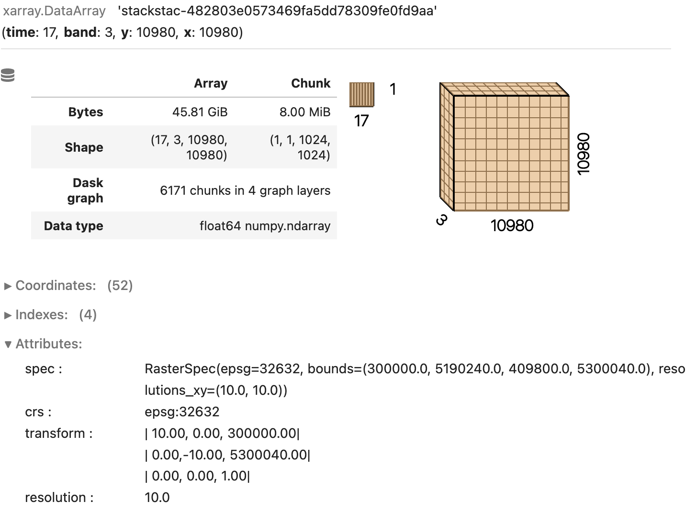
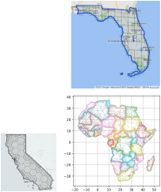

class: middle, center, title-slide
count: false

# Spherical Geometry and Discrete Global Grid Systems (DGGS) Across Languages

.center.width-60[]

SDSL - Prague, September 2024

<br>

---

class: middle, center, dark-slide

# The Earth is not flat

.center.width-70[]

---

class: middle, center, dark-slide

# Vector data

---

# Why not using projected coordinates?

- my data is in latitude / longitude coordinates
- projection is not always trivial
  - choose a coordinate system depending on location, extent, etc.
  - may be computationally expensive
- boundary singularities, distortion.

.center.width-60[]
.smaller-xx[https://github.com/jorisvandenbossche/geopandas-tutorial]

---

# Global analysis

.center.width-100[]

---

# Projecting global datasets

.center.width-100[]

---

# Spherical geometry across languages

| Library   | Language   | Repository |
| :-------- | :---------------- | :------------------------ |
| S2        |  R                | https://github.com/r-spatial/s2/ |
| Spherely  | Python            | https://github.com/benbovy/spherely |
| GeometryOps.jl ? (\*) | Julia     | https://github.com/JuliaGeo/GeometryOps.jl |

(\*) https://github.com/JuliaGeo/GeometryOps.jl/issues/17


| Library   | Language   | Repository |
| :-------- | :---------------- | :------------------------ |
| S2Geometry   | C++            | https://github.com/google/s2geometry |
| S2Geography  | C++            | https://github.com/paleolimbot/s2geography |
| Geo ?        | Rust           | https://github.com/georust/geo |

---

# Spherely Python bindings

Using Pybind11... Just a few lines of C++ code!

.smaller-x[
```cpp
bool contains(PyObjectGeography a, PyObjectGeography b) {
    const auto& a_index = a.as_geog_ptr()->geog_index();
    const auto& b_index = b.as_geog_ptr()->geog_index();

    S2BooleanOperation::Options options;
    return s2geography::s2_contains(a_index, b_index, options);
}

void init_predicates(pybind11::module& m) {
    m.def("contains", pybind11::vectorize(&contains));
}
```
]

---

# Integration with (geo) data-frame and data-cube libraries

- R's `sf`: global flag `sf_use_s2(TRUE)` + conversion methods
- Python's `geopandas`: `GeographyArray` ?
- Python's `xvec`: `GeographyIndex` ?

---

class: middle, center, dark-slide

# Gridded data

---

# Gridded data examples 

ERA5 / global / unprojected

.center[.width-60[].width-40[]]

---

# Gridded data examples

Sentinel-2 / regional / UTM-projected

.center[.width-60[].width-40[]]

---

# Discrete Global Grid System (DGGS)

Tesselation of the entire Earth surface (sphere) evenly into a hierarchy of grid cells.

<br>

.center.width-50[]

---

# Many different DGGSs

.center[.width-30[].width-30[]]
<br>
.center[.width-30[.width-30[]]]

Properties: cell shapes and distribution, aperture, congruent parent-child cells...

---

# Properties common to all DGGSs

- hierarchical structure: multi-resolution friendly
- unique indexing system: spatial index friendly
- ISO / OGC API standards: work in progress (https://ogcapi.ogc.org/dggs/)

.center[.width-50[]]

.smaller-x[(M. Veerman (WUR) - https://nextgems-h2020.eu)]

---

# Multi-resolution

.center.width-60[]

---

# Overview of DGGS Libraries

| Library   | Language (implementation)   | Repository |
| :-------- | :---------------- | :------------------------ |
| H3        |  C                | https://github.com/uber/h3 |
| H3o       | Rust              | https://github.com/HydroniumLabs/h3o |
| S2        | C++               | https://github.com/google/s2geometry |
| Healpix   | C - C++ - Fortran | https://healpix.sourceforge.io |
| DGGRID    | C - C++           | https://github.com/sahrk/DGGRID |
| OpenEAGGR | C++               | https://github.com/riskaware-ltd/open-eaggr/ |
| STARE     | C - C++           | https://github.com/SpatioTemporal/STARE |

---

# DGGS in Julia

DGGS.jl: https://github.com/danlooo/DGGS.jl

---

# DGGS in R

?

---

# DGGS in Python

| Library   | Actively maintained?  | Vectorized? | Comments |
| :-------- | :---------------- | :------------------------ |
| h3py        |  yes      | partially | bindings of H3 (C / Cython) |
| h3ronpy    | yes        | yes | built on top of H3o, pandas / arrow integration |
| S2  | no?              | no | bindings of S2 (C++ / SWIG) |
| s2phere | no  | no | pure-Python implementation of S2 |
| healpy | yes | yes | |
| dggrid4py | yes | ? | wrapper around DGGRID command-line interface |
 
---

class: middle, center, dark-slide

# Towards a unified (Python) API?

---

# Xarray

- labeled Numpy arrays
- multi-dimensional Pandas data frames

<br><br>

.center[.width-80[]]

---

# Xarray custom indexes

<br><br>

.center[.width-100[]]

<br>

xvec: https://xvec.readthedocs.io

---

# Xarray custom indexes

<br><br>

.center[.width-100[]]

<br>

xvec: https://xvec.readthedocs.io

---

# Xarray custom indexes

<br><br>

.center[.width-100[]]

<br>

xvec: https://xvec.readthedocs.io

---

# Xdggs

Example with H3:

.center[.width-100[]]

---

# Xdggs

Example with H3:

.center[.width-100[]]

---

# Xdggs Demo

Community effort!

Alexander Kmoch, Benoît Bovy, Daniel Loos, Evelyn Uuemaa, Wai
Tik Chan, Ryan Abernathey, Justus Magin, Alejandro Coca-Castro, Peter Strobl,
Anne Fouilloux, Jean-Marc Delouis, Tina Odaka
 
Code repository: https://github.com/xarray-contrib/xdggs
 
---

# Xdggs development roadmap

## Conversion to/from DGGS

```python
# convert from lat/lon grid
ds.dggs.from_latlon_grid(...)

# convert from raster
ds.dggs.from_raster(...)

# convert from point data (with aggregation using Xarray API)
ds.dggs.from_points(...).groupby(...).mean()

# convert to lat/lon grid
ds.dggs.to_latlon_grid(...)

# convert to raster
ds.dggs.to_raster(...)

# convert to points (cell centroids)
ds.dggs.to_points(...)

# convert to polygons (cell boundaries)
ds.dggs.to_polygons(...)
```

---

# Xdggs development roadmap

## Extracting DGGS Cell Geometries (shapely or spherely)

```python
# return a DataArray of DGGS cell centroids as shapely.POINT objs
ds.dggs.cell_centroids()

# return a DataArray of DGGS cell boundaries as shapely.POLYGON objs
ds.dggs.cell_boundaries()

# return a DataArray of DGGS cell envelopes as shapely.POLYGON objs
ds.dggs.cell_envelopes()
```

---

# Xdggs development roadmap

## Advanced spatial queries

- support it directly via `ds.dggs.query()` if this is supported in backend DGGS libraries
- alternatively, convert cells to vector geometries and use `xvec` (non-optimal)

## Hierarchical operations

- change grid resolution (i.e., DGGS-aware `.reindex()`)
- aggregation using Xarray's `.groupby()`

---

# Xdggs development roadmap

## Data cube alignment

- DGGS-aware comparison od Datasets and DataArrays

## Plotting

- via conversion to a gridded or raster data cube
- via conversion to a vector data cube (`xvec`)
- plotting it directly via `lonboard` (H3, S2)

---

# Conclusion (open questions)

- Use cases
  - Do we really need spherical geometry / DGGS?
  - Which features do we need (roadmap)?
- Leveraging low-level libraries in high-level languages
  - Fragmented ecosystem
- Integration with geo data-frame and data-cube libraries
- Sphere vs. ellipsoid
